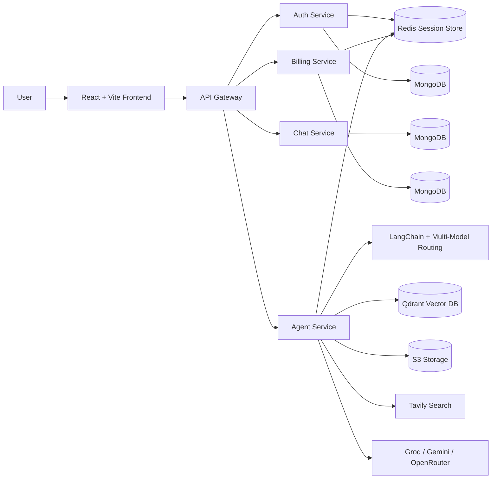
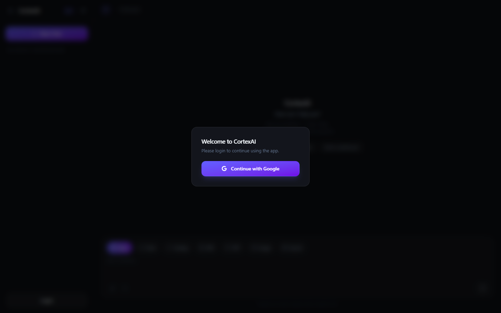
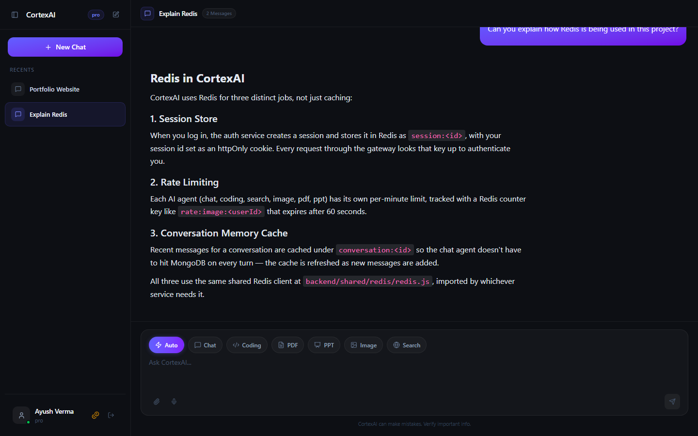
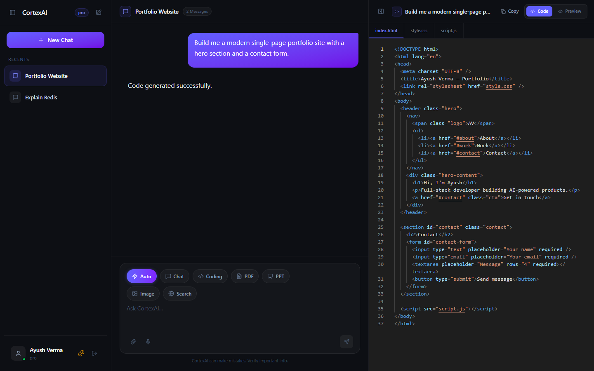

# Cortex AI

<p align="center">
  
  
  
  
  
  
</p>

## Professional Overview

Cortex AI is a full-stack, multi-service GenAI workspace that combines chat, coding assistance, image generation, PDF generation, PDF RAG, vision understanding, presentation generation, billing, and credit-based access control into one product.

The system is built around a gateway-driven microservice architecture. A React + Vite frontend communicates with a Node.js gateway, which routes authenticated requests to specialized backend services for authentication, chat persistence, billing, and AI orchestration. The AI service uses LangChain, multiple model providers, Redis rate limiting, file upload handling, vector search, and external integrations to deliver a product-like AI experience instead of a single-purpose chatbot.

## Key Features

- Multi-agent AI routing for chat, coding, search, PDF, PPT, image, vision, and PDF RAG workflows
- A search agent that behaves agentically: it reformulates its own query via an LLM and retries (up to 3x) when the web search returns nothing useful, instead of just returning an empty result
- Server-Sent Event streaming (`/api/agent/chat/stream`) so responses render token-by-token instead of waiting for the full reply
- Google authentication with Firebase Admin session management
- Conversation persistence with reusable chat history
- PDF upload and retrieval-augmented answering from document context
- AI image generation with S3-backed download links
- AI-generated PDFs and presentations with downloadable artifacts
- Credit-based billing with plan upgrades and usage deduction
- Redis-backed rate limiting per agent type, enforced independently of whether the underlying generation call itself succeeds
- Service-to-service authentication (shared secret) on every internal route, with request validation (zod) on every controller
- Structured JSON logging with request-id tracing across services, and per-LLM-call token/cost logging
- Artifact panel with code preview and live preview support
- Responsive dark UI with speech input support and file attachments

## System Architecture



### How Requests Flow

1. The user logs in through Firebase Google sign-in.
2. The frontend sends the Firebase token to the auth service through the gateway.
3. The auth service verifies the identity token, creates or updates the user, and stores session data in Redis.
4. The user sends a prompt from the chat UI.
5. The gateway forwards the request to the agent service with user context.
6. The agent service routes the prompt to the right AI workflow using LangGraph and specialized agents.
7. The response is persisted in the chat service and returned to the frontend.
8. If the response produces an artifact, the UI renders it in the artifact panel.

## Multi-Agent Architecture

The AI layer is not a single prompt wrapper. It is organized as a routing graph with specialized nodes:

- Router node: decides whether a request should go to chat, search, coding, pdf, ppt, image, vision, or PDF RAG
- Chat agent: general conversational assistant with memory-aware responses
- Search agent: web lookup through Tavily
- Coding agent: code generation and technical help
- PDF agent: structured PDF generation with downloadable output
- PPT agent: slide deck generation with formatted slides
- Image agent: image prompt enhancement plus image generation and S3 upload
- Vision agent: image understanding and OCR-style interpretation
- PDF RAG agent: document ingestion, chunking, embeddings, Qdrant similarity search, and grounded answers

This is the strongest part of the project because it demonstrates orchestration, task specialization, state management, and retrieval-based reasoning.

The search agent goes one step further than routing: rather than a single fixed call, it runs an observe/retry loop — if the initial Tavily search returns no usable results, it asks an LLM to reformulate the query (broaden terms, try synonyms) and retries, up to three attempts, before falling back to an empty result set.

## Tech Stack

| Layer | Technologies |
|---|---|
| Frontend | React 19, Vite, Redux Toolkit, React Router, Framer Motion, Tailwind CSS, Monaco Editor |
| Backend | Node.js, Express.js, Mongoose, Multer, Helmet, CORS |
| Validation | Zod (request schemas on every controller) |
| Observability | Pino / pino-http (structured logs, request-id tracing) |
| Testing | Vitest, Supertest |
| AI / Orchestration | LangChain, LangGraph, Google Generative AI, Groq, OpenRouter, Tavily |
| Data | MongoDB, Redis, Qdrant |
| Auth | Firebase Authentication, Firebase Admin |
| Billing | Razorpay |
| Storage | Amazon S3 |
| Deployment | Docker, Docker Compose |

## AI / LLM Technologies Used

- LangGraph for agent routing and conditional workflows
- LangChain message primitives for prompt/history composition
- Gemini for vision and multimodal tasks
- Groq for fast chat/search/coding generation
- OpenRouter for coding-specific model routing
- Tavily for web search augmentation
- Qdrant for vector similarity search in PDF RAG
- Embeddings via Google Generative AI embeddings

## Folder Structure

```text
backend/
  gateway/                  # API gateway and auth-aware proxy layer
  services/
    auth/                   # Firebase auth, sessions, user plan management
      middlewares/          # internal-service shared-secret auth
      validators/           # zod request schemas
    chat/                   # conversation and message persistence
      validators/
    billing/                # plans, payment verification, credit upgrades
      validators/
    agent/                  # AI routing, tools, RAG, generation, artifacts
      validators/
      utils/logLLMUsage.js  # wraps every LLM call with token/cost logging
  shared/
    redis/                  # shared Redis client
    logger/                 # pino logger + pino-http request middleware
    validation/            # shared zod validate() middleware
  docker-compose.yml

frontend/
  src/
    components/             # chat UI, sidebar, billing drawer, artifact panel
    features/               # API clients (incl. SSE stream consumer)
    pages/                  # Home page
    redux/                  # app state slices
    hooks/                  # auth/user hook
```

## Screenshots

> Add your own screenshots here after running the app locally.

### Login Screen



### Main Chat Workspace



### Artifact / Preview Panel



## Installation Guide

### Prerequisites

- Node.js 18+ or newer
- Docker and Docker Compose
- MongoDB instance
- Redis instance
- Firebase project with Google sign-in enabled
- Razorpay account for billing features
- API keys for Gemini, Groq, OpenRouter, Tavily, and S3 credentials

### 1) Clone the repository

```bash
git clone <your-repo-url>
cd cortex-ai
```

### 2) Install dependencies

Install the frontend, the `backend/` root (holds shared code's dependencies, such as the Redis client and logger used by `backend/shared/`), and each backend service separately:

```bash
cd frontend
npm install

cd ../backend
npm install

cd services/auth
npm install

cd ../chat
npm install

cd ../billing
npm install

cd ../agent
npm install

cd ../../gateway
npm install
```

### 3) Configure environment variables

Create a `.env` file for the gateway and for each service (`backend/gateway/.env`, `backend/services/auth/.env`, etc.) using the variables listed below. Every service that calls `/internal/*` routes on the auth service, and the auth service itself, must share the same `INTERNAL_SERVICE_SECRET` value.

### 4) Start the stack with Docker Compose

`docker compose up` builds and runs MongoDB, Redis, Qdrant, and all five backend services together, wired to talk to each other over the Compose network:

```bash
cd backend
docker compose up --build
```

The gateway is then reachable at `http://localhost:8000`. Run the frontend separately with `npm run dev` (see below) and point `VITE_SERVER_URL` at that URL.

If you'd rather run services individually with `npm run dev` (useful while iterating), you can still start just the infrastructure containers:

```bash
cd backend
docker compose up -d mongo redis qdrant
```

## Environment Variables

### Gateway

- `PORT` - gateway port, default `5000`
- `AUTH_SERVICE` - auth service base URL
- `CHAT_SERVICE` - chat service base URL
- `AGENT_SERVICE` - agent service base URL
- `BILLING_SERVICE` - billing service base URL
- `REDIS_URL` - Redis connection string, used to look up sessions in the `protect` middleware

### Auth Service

- `PORT` - auth service port
- `MONGODB_URL` - MongoDB connection string
- `REDIS_URL` - Redis connection string
- `INTERNAL_SERVICE_SECRET` - shared secret required on the `x-internal-secret` header for `/internal/*` routes; must match the value used by the billing and agent services
- A Firebase service account file at `backend/services/auth/serviceAccount.json` (download from Firebase Console → Project Settings → Service Accounts → Generate new private key). If this file is missing, the service still starts (and `/logout` and the internal routes still work), but `POST /login` returns `503` until it's provided — it degrades instead of crashing the whole process.

### Chat Service

- `PORT` - chat service port
- `MONGODB_URL` - MongoDB connection string

### Billing Service

- `PORT` - billing service port
- `MONGODB_URL` - MongoDB connection string
- `RAZORPAY_KEY_ID` - Razorpay key ID
- `RAZORPAY_KEY_SECRET` - Razorpay secret key
- `AUTH_SERVICE` - auth service base URL for plan updates
- `INTERNAL_SERVICE_SECRET` - shared secret sent on the `x-internal-secret` header when calling the auth service's internal routes

### Agent Service

- `PORT` - agent service port
- `MONGODB_URL` - MongoDB connection string
- `REDIS_URL` - Redis connection string
- `CHAT_SERVICE` - chat service base URL for message persistence
- `AUTH_SERVICE` - auth service base URL for credit deduction
- `INTERNAL_SERVICE_SECRET` - shared secret sent on the `x-internal-secret` header when calling the auth service's internal routes
- `GOOGLE_API_KEY` - Gemini / embeddings API key
- `GROQ_API_KEY` - Groq API key (read implicitly by `@langchain/groq`)
- `OPENROUTER_API_KEY` - OpenRouter API key (read implicitly by `@langchain/openrouter`)
- `TAVILY_API_KEY` - Tavily search API key
- `QDRANT_URL` - Qdrant base URL
- `QDRANT_API_KEY` - Qdrant API key (optional for a local/unauthenticated instance)
- `S3_BUCKET_NAME` - S3 bucket name
- `AWS_ACCESS_KEY_ID` - AWS access key
- `AWS_SECRET_ACCESS_KEY` - AWS secret key
- `AWS_REGION` - AWS region
- `INTERNAL_SERVICE_SECRET` - shared secret sent on the `x-internal-secret` header when calling the auth service's internal routes

## Running the Project

### Frontend

```bash
cd frontend
npm run dev
```

### Backend services

Start each service in its own terminal:

```bash
cd backend/gateway
npm run dev

cd backend/services/auth
npm run dev

cd backend/services/chat
npm run dev

cd backend/services/billing
npm run dev

cd backend/services/agent
npm run dev
```

## Testing

Auth, billing, and agent each have a Vitest + Supertest suite covering the parts most worth trusting: the internal-service auth middleware, the shared zod validator, per-agent rate limiting, the search agent's retry/reformulation loop, the SSE controller, and the billing controller's Razorpay/signature paths.

```bash
cd backend/services/auth
npm test

cd ../billing
npm test

cd ../agent
npm test
```

This is a thin layer, not full coverage — see [Future Improvements](#future-improvements).

### Verifying the stack locally without cloud credentials

You can confirm the plumbing works end to end using only a local MongoDB and Redis (no Firebase/Groq/Gemini/Razorpay/S3 keys needed):

1. Point each service's `.env` at `mongodb://localhost:27017/...` and `redis://localhost:6379`, and give auth/billing/agent the same `INTERNAL_SERVICE_SECRET`.
2. Start chat, billing, agent, and gateway with `npm run dev` (auth will start too — see the note above about `serviceAccount.json`).
3. Since there's no real Firebase login without credentials, you can simulate an authenticated session directly: insert a user document into the auth service's Mongo database, then write a matching `session:<id>` key into Redis with the same shape the auth service's `login` handler creates (see `backend/services/auth/controllers/auth.controllers.js`), and send that id as the `session` cookie.
4. From there you can exercise the real routes — `GET /api/me`, chat CRUD, and `POST /api/agent/chat` / `/chat/stream` — and confirm session lookup, zod validation, per-agent rate limiting, cross-service credit deduction (agent → auth over the internal-secret header), and SSE event framing all work. The only thing that requires real credentials is the final external call (Groq/Gemini/Tavily/Razorpay/Firebase) — those fail with a clean, provider-reported error (e.g. Groq's `401 Invalid API Key`) rather than crashing the process, which is itself confirmation the integration wiring is correct.

## API Endpoints

### Gateway

| Method | Endpoint | Purpose |
|---|---|---|
| GET | `/` | Gateway health check |
| GET | `/api/me` | Get current user |
| All | `/api/auth/*` | Proxy to auth service |
| All | `/api/chat/*` | Proxy to chat service |
| All | `/api/agent/*` | Proxy to agent service |
| All | `/api/billing/*` | Proxy to billing service |

### Auth Service

| Method | Endpoint | Purpose |
|---|---|---|
| POST | `/login` | Verify Firebase token and create session |
| GET | `/logout` | Destroy session |
| PATCH | `/internal/update-plan` | Update user plan and credits |
| PATCH | `/internal/deduct-credits` | Deduct credits for agent usage |

### Chat Service

| Method | Endpoint | Purpose |
|---|---|---|
| POST | `/create-conversation` | Create a new conversation |
| GET | `/get-conversations` | List user conversations |
| POST | `/update-conversation` | Update conversation title |
| POST | `/save-message` | Persist chat message |
| GET | `/get-messages/:id` | Fetch messages for a conversation |

### Billing Service

| Method | Endpoint | Purpose |
|---|---|---|
| POST | `/create-order` | Create a Razorpay order |
| POST | `/verify-payment` | Verify payment and update user plan |

### Agent Service

| Method | Endpoint | Purpose |
|---|---|---|
| POST | `/chat` | Send prompt, optional file, and get a full AI response (single JSON reply) |
| POST | `/chat/stream` | Same as `/chat`, but streams the response as Server-Sent Events (`agent`, `token`, `done`, `error`) |

## Observability

- Every service logs structured JSON via `pino` (`backend/shared/logger`), replacing ad-hoc `console.log` calls.
- The gateway assigns (or forwards) an `x-request-id` per request and propagates it to every proxied service, so a single request can be traced across the gateway → auth/chat/billing/agent boundary via that ID.
- Every LLM call in the agent graph goes through `invokeWithUsage` (`backend/services/agent/utils/logLLMUsage.js`), which logs latency, token usage, and an approximate USD cost per call, tagged with the agent name, user, and conversation.

## Future Improvements

- Add unit/integration coverage for the remaining controllers and agents beyond the current thin layer (auth login/logout, chat/agent CRUD routes, PDF/PPT/image agents), plus e2e tests
- Add prompt versioning and quality/eval metrics for each agent, on top of the new per-call token/cost logs
- Add stronger file validation and prompt-injection defenses
- Add distributed tracing (e.g. OpenTelemetry) on top of the new request-id propagation
- Add conversation search, pinning, and workspace organization
- Add deployment automation with CI/CD and environment promotion
- Replace placeholder demo flows with production-grade artifact templates

## Challenges Solved

- Built a gateway-based microservice architecture instead of a monolith
- Coordinated multiple AI providers behind a single user experience
- Added retrieval-augmented QA for uploaded PDFs
- Implemented credit and rate-limit controls for expensive AI operations, and made sure those failures (429 / insufficient credits) are surfaced to the client instead of being swallowed by an agent's own error handling
- Locked down service-to-service calls (`/internal/*`) with a shared-secret middleware instead of leaving them open behind the gateway
- Added request tracing (`x-request-id`) across the gateway → service boundary, and structured logging in place of ad-hoc `console.log`
- Persisted user conversations and messages across sessions
- Managed generated files and preview artifacts in the frontend

## Learning Outcomes

- Microservice communication patterns in Node.js
- Agent routing and orchestration with LangGraph
- Retrieval-augmented generation with vector databases
- Auth/session design using Firebase and Redis
- Billing and quota management for AI products
- Frontend state orchestration for conversational applications

## Why This Project Stands Out

- It is not a basic chatbot; it is a multi-agent AI product with real workflows, including an agent that retries and reformulates its own queries rather than just routing once
- It combines LLMs, RAG, file handling, billing, auth, and persistence
- It has a clear architecture that maps well to real-world SaaS systems
- The artifact panel and generated outputs make the AI capabilities visible to users
- It takes security and operability seriously: authenticated internal endpoints, request tracing, structured logs, per-call cost visibility, and a real (if thin) test suite — not just a demo that only works on the happy path
- The stack is recruiter-friendly and demonstrates practical engineering depth

## License

This project currently does not include an explicit license.
